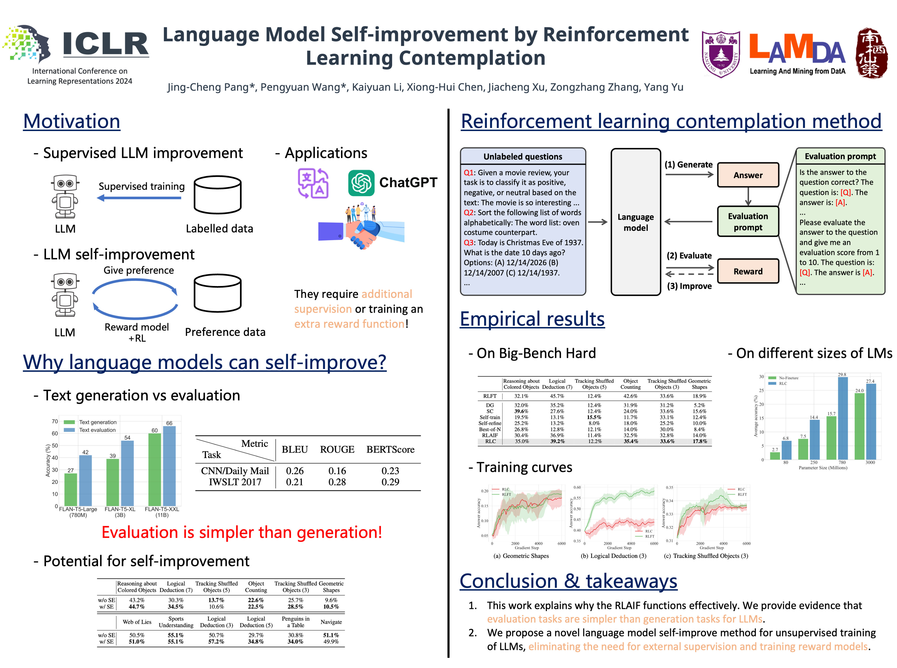

## Reinforcement Learning Contemplation (RLC)

------



Official implementation for paper [Language Model Self-improvement by Reinforcement Learning Contemplation](https://openreview.net/forum?id=38E4yUbrgr), which is accepted at ICLR 2024.


## How to run the code?
------

1. Install necessary dependencies.

Python version used for experiment is 3.10. Install packages for python:
```
pip install -r requirements.txt
```

Install trlx, which is built based on the open-sourced trlx repository for training LLMs with RL. 
Note that we made some changes to the original trlx. 
```
cd ./trlx_ours
pip install torch==2.0.0 --extra-index-url https://download.pytorch.org/whl/cu116 # for cuda
pip install -e .
```


2. Run the code.

```
python RLC.py --ask_mode "standard_answer_reward" --is_chain_of_thought True --model_name google/flan-t5-large --bbh_set date_understanding
```

3. Optional arguments for running the main file.
- --model_name: which model to load
- --ask_mode: how to ask for judgement
- --is_chain_of_thought: whether to use chain of thought technique
- --dataset_name: The Specific dataset name:[TruthfulQA, CommonQA, BIG-Bench-Hard/bbh, human_annotations]
- --llm_generate_mode: generate mode : (multinomial_sampling)
- --few_shot_cot: number of CoT demonstrations to use (only for BigBench dataset)


## Citations

Please cite the paper if you use RLC method or find the paper insightful. Feel free to contact the authors or open an issue if you have any questions.

```bibtex
@inproceedings{pang2024rlc,
  author       = {Jing{-}Cheng Pang and
                  Pengyuan Wang and
                  Kaiyuan Li and
                  Xiong{-}Hui Chen and
                  Jiacheng Xu and
                  Zongzhang Zhang and
                  Yang Yu},
  title        = {Language Model Self-improvement by Reinforcement Learning Contemplation},
  booktitle    = {The Twelfth International Conference on Learning Representations (ICLR)},
  year         = {2024}
}
```
